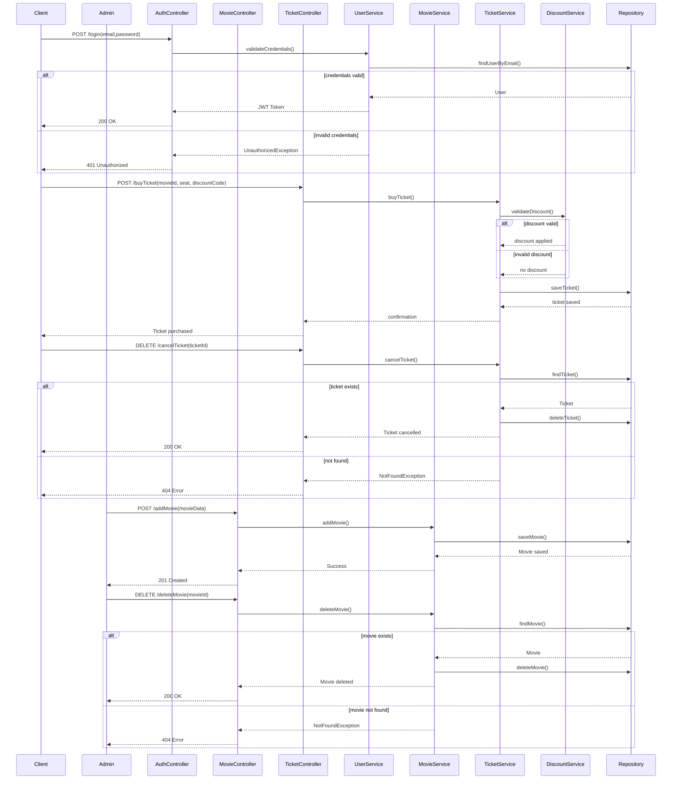

```mermaid
sequenceDiagram

    participant C as Client
    participant A as Admin
    participant Auth as AuthController
    participant MovieC as MovieController
    participant TicketC as TicketController
    participant UserS as UserService
    participant MovieS as MovieService
    participant TicketS as TicketService
    participant DiscS as DiscountService
    participant Repo as Repository

    %% LOGIN
    C->>Auth: POST /login(email,password)
    Auth->>UserS: validateCredentials()
    UserS->>Repo: findUserByEmail()

    alt credentials valid
        Repo-->>UserS: User
        UserS-->>Auth: JWT Token
        Auth-->>C: 200 OK
    else invalid credentials
        UserS-->>Auth: UnauthorizedException
        Auth-->>C: 401 Unauthorized
    end

    %% BUY TICKET
    C->>TicketC: POST /buyTicket(movieId, seat, discountCode)
    TicketC->>TicketS: buyTicket()

    TicketS->>DiscS: validateDiscount()

    alt discount valid
        DiscS-->>TicketS: discount applied
    else invalid discount
        DiscS-->>TicketS: no discount
    end

    TicketS->>Repo: saveTicket()
    Repo-->>TicketS: ticket saved
    TicketS-->>TicketC: confirmation
    TicketC-->>C: Ticket purchased

    %% CANCEL TICKET
    C->>TicketC: DELETE /cancelTicket(ticketId)
    TicketC->>TicketS: cancelTicket()

    TicketS->>Repo: findTicket()

    alt ticket exists
        Repo-->>TicketS: Ticket
        TicketS->>Repo: deleteTicket()
        TicketS-->>TicketC: Ticket cancelled
        TicketC-->>C: 200 OK
    else not found
        TicketS-->>TicketC: NotFoundException
        TicketC-->>C: 404 Error
    end

    %% ADMIN ADD MOVIE
    A->>MovieC: POST /addMovie(movieData)
    MovieC->>MovieS: addMovie()
    MovieS->>Repo: saveMovie()
    Repo-->>MovieS: Movie saved
    MovieS-->>MovieC: Success
    MovieC-->>A: 201 Created

    %% ADMIN DELETE MOVIE
    A->>MovieC: DELETE /deleteMovie(movieId)
    MovieC->>MovieS: deleteMovie()
    MovieS->>Repo: findMovie()

    alt movie exists
        Repo-->>MovieS: Movie
        MovieS->>Repo: deleteMovie()
        MovieS-->>MovieC: Movie deleted
        MovieC-->>A: 200 OK
    else movie not found
        MovieS-->>MovieC: NotFoundException
        MovieC-->>A: 404 Error
    end
```

