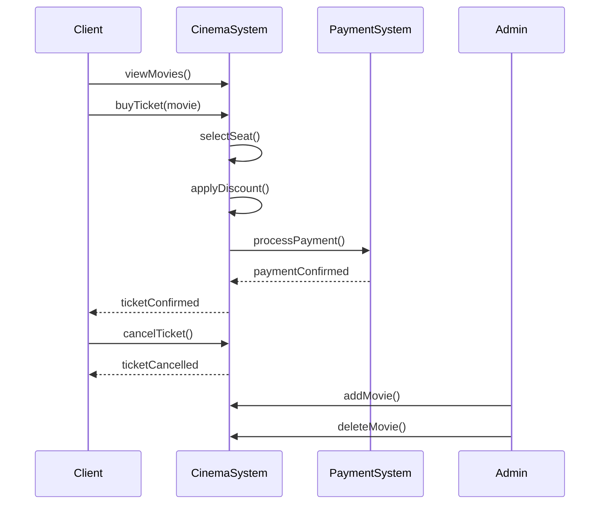

```mermaid
sequenceDiagram

    participant Client
    participant CinemaSystem
    participant PaymentSystem
    participant Admin

    %% Client vede filme
    Client->>CinemaSystem: viewMovies()

    %% Cumpara bilet
    Client->>CinemaSystem: buyTicket(movie)
    CinemaSystem->>CinemaSystem: selectSeat()
    CinemaSystem->>CinemaSystem: applyDiscount()
    CinemaSystem->>PaymentSystem: processPayment()
    PaymentSystem-->>CinemaSystem: paymentConfirmed
    CinemaSystem-->>Client: ticketConfirmed

    %% Anuleaza bilet
    Client->>CinemaSystem: cancelTicket()
    CinemaSystem-->>Client: ticketCancelled

    %% Admin adauga film
    Admin->>CinemaSystem: addMovie()

    %% Admin sterge film
    Admin->>CinemaSystem: deleteMovie()
```
