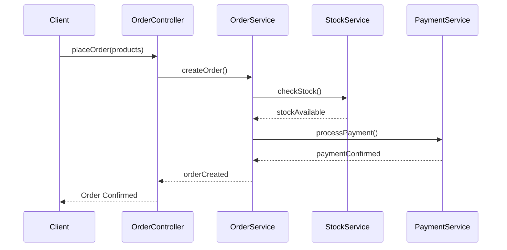

```mermaid
sequenceDiagram
    participant C as Client
    participant OC as OrderController
    participant OS as OrderService
    participant SS as StockService
    participant PS as PaymentService

    C->>OC: placeOrder(products)
    OC->>OS: createOrder()

    OS->>SS: checkStock()
    SS-->>OS: stockAvailable

    OS->>PS: processPayment()
    PS-->>OS: paymentConfirmed

    OS-->>OC: orderCreated
    OC-->>C: Order Confirmed
```

