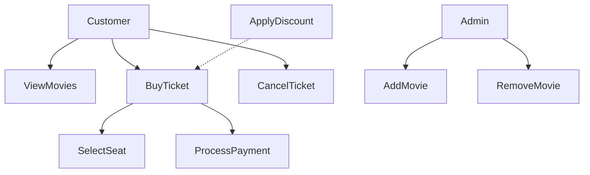

# Cinema Use Case Diagram

## Explanation

Actors:

* Customer
* Admin

Use Cases:

* View Movies
* Buy Ticket
* Cancel Ticket
* Add Movie
* Remove Movie

Relationships:

* Buy Ticket **includes** Select Seat
* Buy Ticket **includes** Process Payment
* Apply Discount **extends** Buy Ticket

