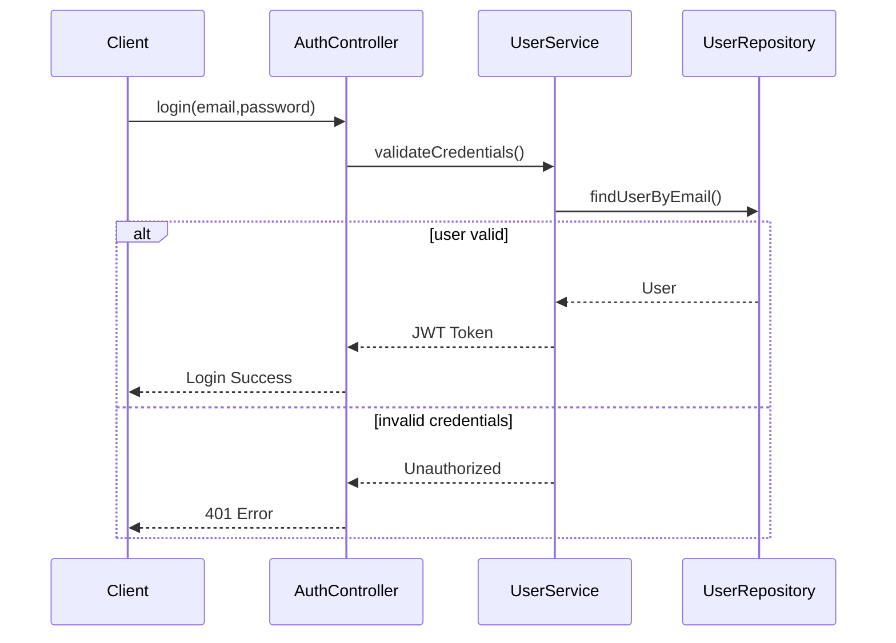

```mermaid
sequenceDiagram
    participant C as Client
    participant A as AuthController
    participant U as UserService
    participant R as UserRepository

    C->>A: login(email,password)
    A->>U: validateCredentials()
    U->>R: findUserByEmail()

    alt user valid
        R-->>U: User
        U-->>A: JWT Token
        A-->>C: Login Success
    else invalid credentials
        U-->>A: Unauthorized
        A-->>C: 401 Error
    end
```

