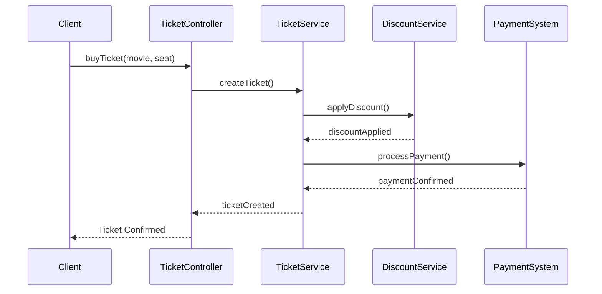

```mermaid
sequenceDiagram
    participant C as Client
    participant TC as TicketController
    participant TS as TicketService
    participant DS as DiscountService
    participant PS as PaymentSystem

    C->>TC: buyTicket(movie, seat)
    TC->>TS: createTicket()

    TS->>DS: applyDiscount()
    DS-->>TS: discountApplied

    TS->>PS: processPayment()
    PS-->>TS: paymentConfirmed

    TS-->>TC: ticketCreated
    TC-->>C: Ticket Confirmed
```

