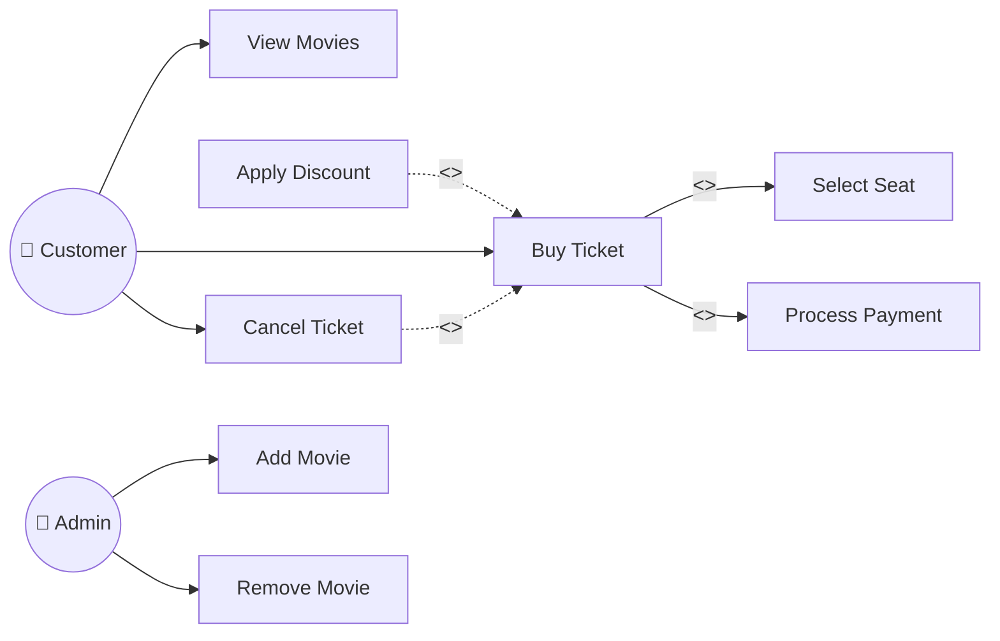

Cinema Use Case Diagram

```mermaid
flowchart LR

Customer((👤 Customer))
Admin((👤 Admin))

ViewMovies[View Movies]
BuyTicket[Buy Ticket]
SelectSeat[Select Seat]
ProcessPayment[Process Payment]
ApplyDiscount[Apply Discount]
CancelTicket[Cancel Ticket]

AddMovie[Add Movie]
RemoveMovie[Remove Movie]

Customer --> ViewMovies
Customer --> BuyTicket
Customer --> CancelTicket

Admin --> AddMovie
Admin --> RemoveMovie

BuyTicket -->|<<include>>| SelectSeat
BuyTicket -->|<<include>>| ProcessPayment

ApplyDiscount -.->|<<extend>>| BuyTicket
CancelTicket -.->|<<extend>>| BuyTicket
```

