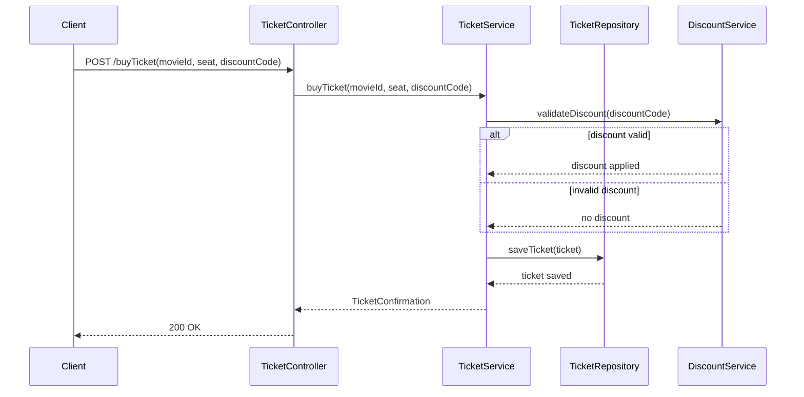
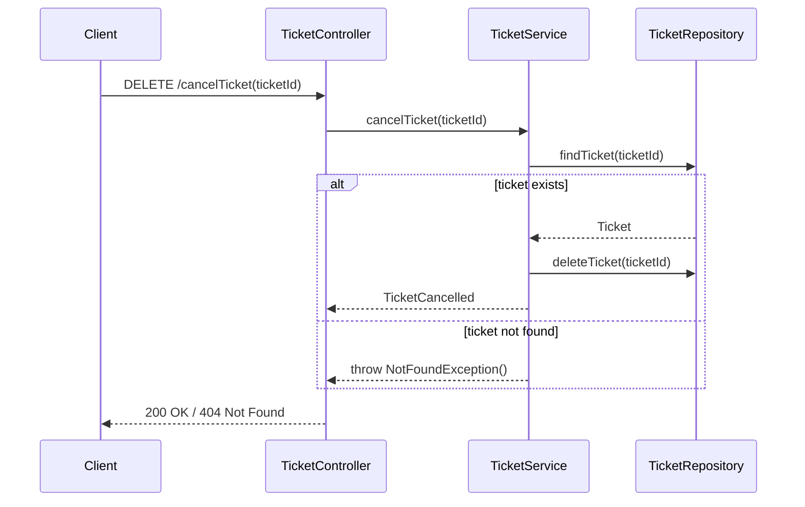
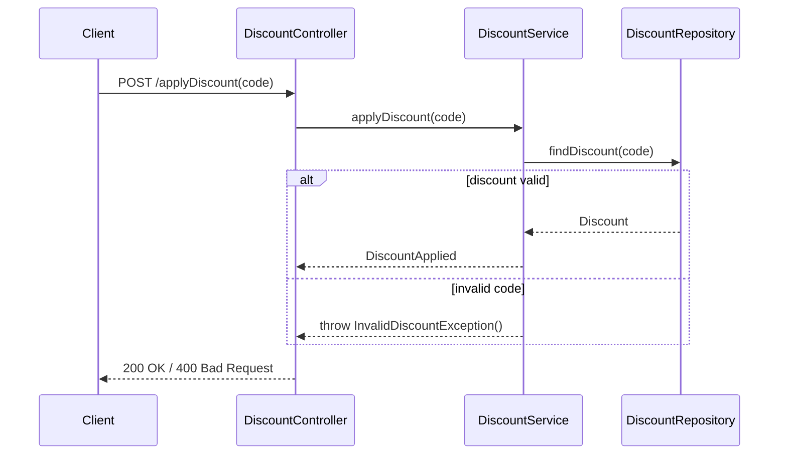
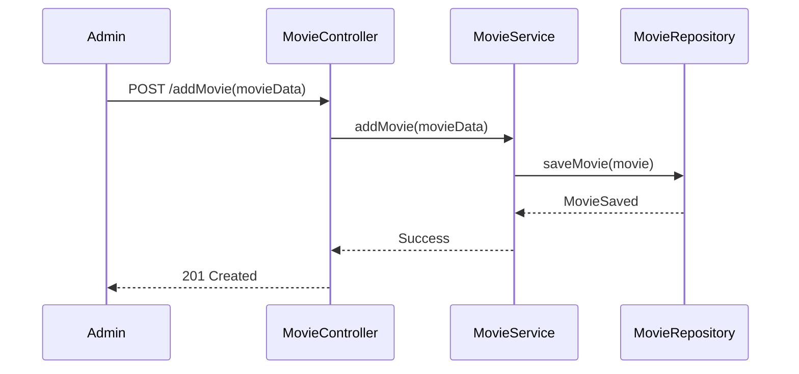
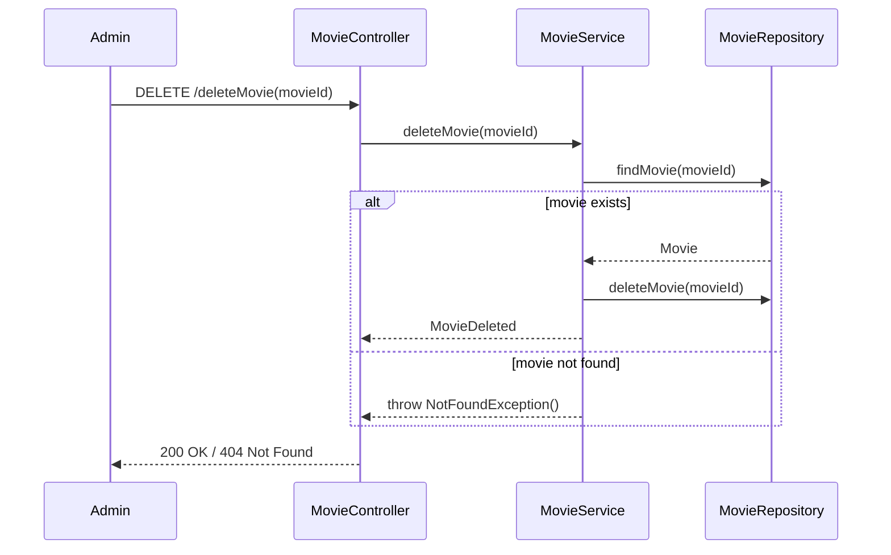

```mermaid
sequenceDiagram
    participant C as Client
    participant T as TicketController
    participant S as TicketService
    participant R as TicketRepository
    participant D as DiscountService

    C->>T: POST /buyTicket(movieId, seat, discountCode)
    T->>S: buyTicket(movieId, seat, discountCode)

    S->>D: validateDiscount(discountCode)

    alt discount valid
        D-->>S: discount applied
    else invalid discount
        D-->>S: no discount
    end

    S->>R: saveTicket(ticket)
    R-->>S: ticket saved

    S-->>T: TicketConfirmation
    T-->>C: 200 OK
```

---

```mermaid
sequenceDiagram
    participant C as Client
    participant T as TicketController
    participant S as TicketService
    participant R as TicketRepository

    C->>T: DELETE /cancelTicket(ticketId)
    T->>S: cancelTicket(ticketId)

    S->>R: findTicket(ticketId)

    alt ticket exists
        R-->>S: Ticket
        S->>R: deleteTicket(ticketId)
        S-->>T: TicketCancelled
    else ticket not found
        S-->>T: throw NotFoundException()
    end

    T-->>C: 200 OK / 404 Not Found
```

---

```mermaid
sequenceDiagram
    participant C as Client
    participant D as DiscountController
    participant S as DiscountService
    participant R as DiscountRepository

    C->>D: POST /applyDiscount(code)
    D->>S: applyDiscount(code)

    S->>R: findDiscount(code)

    alt discount valid
        R-->>S: Discount
        S-->>D: DiscountApplied
    else invalid code
        S-->>D: throw InvalidDiscountException()
    end

    D-->>C: 200 OK / 400 Bad Request
```

---

```mermaid
sequenceDiagram
    participant A as Admin
    participant M as MovieController
    participant S as MovieService
    participant R as MovieRepository

    A->>M: POST /addMovie(movieData)
    M->>S: addMovie(movieData)

    S->>R: saveMovie(movie)

    R-->>S: MovieSaved
    S-->>M: Success

    M-->>A: 201 Created
```

---

```mermaid
sequenceDiagram
    participant A as Admin
    participant M as MovieController
    participant S as MovieService
    participant R as MovieRepository

    A->>M: DELETE /deleteMovie(movieId)
    M->>S: deleteMovie(movieId)

    S->>R: findMovie(movieId)

    alt movie exists
        R-->>S: Movie
        S->>R: deleteMovie(movieId)
        S-->>M: MovieDeleted
    else movie not found
        S-->>M: throw NotFoundException()
    end

    M-->>A: 200 OK / 404 Not Found
```

